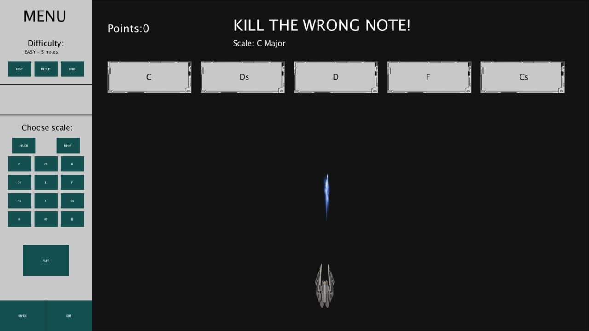

# CPAC Project
## CPAC final project 

# Game APP for educational purpose challenging your knowledge about Scale Harmony Chords and Scales 

## Introduction

This application is a series of games with different levels of difficulty.
ChordSchool is a Processing desktop application allowing the user to challenge her/his memory about Melody Progression, Chord Progression and Scale Correction. According to the rules of scale harmony and melody progression. 

Our application is focused on the educational aspect of Scale harmony, therefore we are visually representing the user choices in key references, relative chords and modes as colors as well as notes over the keyboard, so to help him visualize the relevant music theory aside from hearing the result.

A working version of Music Memory can be found here: https://github.com/enzojam/CPAC/

## User Interface

The Music Memory user interfaces consists of the following main components:
1.	The **Menu**
 where the user mainly chooses among three game. The user can choose the game of her/his choice.

2.	 The **Keyboard** 
that extends over one octave and is displaying the notes composing the major scale of reference as well as the placement of fingers over it for the modal notes in their first position as well as all the possible alterations when applied by the user. Please note that the keyboard is only appear in one of the games

3.	The **Galaxy Shooting** 
The goal behind this game is to test the player's knowledge on scales. It randomly generates a group of notes, some of which are not a part of the selected scale. The player must use his spaceship to shoot the wrong one/s.

4.	The **Melody Memory ** 
The aim of this game is to tease your memory by playing a sequence of notes respectively and then wait for the player to finger the exact sequence on notes in one by one and at the end the game will show you performance result.

5.	The **Chord Drag **
The aim of this game is to challenge your knowledge about scales and famous chord progression. You must order the given chords in the right manner by dragging and dropping them in the boxes. The game is available in 3 difficulties. After you succussed in the game the results will be shown automatically, and the game will move forward.

- 

- As you can seether are many options before you start playing 

- 

## Why It’s Good

The ChordSchool app workflow can be summarized by the following steps:

1.	INSPIRING

      .	Random sequence of notes in a given scale can inspire musicians to help their melody composing process.

2.	SIMPLE UX

      .	It’s so simple to use, anyone with  minimum knowledge of computers would be able to use it.

3.	DIDACTIC

     .	In a innovative and entertaining way it helps you to learn some basic music theory.

6.	 GOALS 

       The main goal of the project is to support users in their path of learning music theory by allowing them to exercise with entertainment. Since there aren’t any similar Works like this, it also offers a different creative experience.
Since the UX and doing the exercises are pretty simple a wide range of users are able to use it.

7.	MAIN FEATURES:
a.	Random note generation (According to given scale)
b.	Note and Mode selection
c.	Different Exercises
d.	Different type of scales
e.	Didactic

8.	IMPLEMENTATION
   	

      . Project is mainly implemented in processing, with some extra features which will be implemented via Python such as motion-tracking. For sound generation minim library available for Processing is used. 

## How to Play

1.	FIRST GAME (MELODY MEMORY)

a.	

2.	SECOND GAME (GALAXY SHOOTING)

      a.	First you choose difficulty, 

      b.	Then select the scale (there are 4 different scales for each of the 12 notes, so 48 in total) 

      c.	In the third step you press play. 

      - when you press play the buttons vanish and a new button "change" appears which lets you change again the parameters in         case you want to play with different difficulty or scale, the procedure is again the same.

      d.	You must shoot the boxes with wrong chords in order to eliminate the chord/chords which doesn’t or don’t belong to the         scales that you selected in the first place 

      - It worth to mention that there is scoring at the end.

      - The selected difficulty changes the number of appearing notes. The harder the level the more boxes appear

      -	Making the game harder changes the number of wrong chords number.

3.	THIRD GAME (CHORD ARRANGE)
* 
- 

a.	You have to fir select “Church mode”
-	also called ecclesiastical mode, in music, any one of eight scalar arrangements of whole and halftones, derived by medieval theorists, most likely from early Christian vocal convention. Thematically, the mature modal system may be represented as follows:
-	Dorian • Lydian • Mixolydian • Aeolian • Phrygian • Locrian A Dorian scale is the scale that begins on the second step of the major scale and keeps the major scale key signature. For example, D - Dorian is related to C major and has no sharps and flats, but it starts on D. A Mixolydian scale is the scale that begins on the fifth step of the major scale and keeps the major scale key signature. 

- To summarize:

* Ionian – Major (no altered notes)
* Dorian – minor +raised 6th, lowered 7th
* Phrygian – minor + lowered 2nd, lowered 6th, lowered 7th
* Lydian – Major + raised 4th
* Mixolydian – Major +lowered 7th
* Aeolian – minor + lowered 6th, lowered 7th

b. Then you must select the difficulty level. These level changes the time of gam e and also create more random chords.

c. And you select “PLAY”

d. First you hear the randomly generated chords. 
   Then the countdown begins. You have to order the chords in the progression you have been asked. 

- 

## INSTALL

To install the game, you must download the “.rar” file first. then in the file “imagetest.pde” you must change three addresses in your PC: 

String sketchpath =
                  "C:/Users/User/Desktop/MusicTheoryArcade/2PianoGame/soroushPiano";
   
String sketchpath =
                   "C:/Users/User/Desktop/MusicTheoryArcade/1ShooterGame/sound_sketch_v1/Latest Version/shootTheNote";
                   
String sketchpath = 
                   "C:/Users/User/Desktop/MusicTheoryArcade/3DragGame/drag7/drag4";
                   
Simply change “drag4”,” shootTheNote”,” soroushPiano”. Folders in the above codes.

## Video Demo
Here is a short demo of our project: https://youtu.be/hOSSSHiEU8Q

Developed by :

-	ANTONIOS PAPPAS	antonio1.papa@mail.polimi.it
-	METEHAN PALA		metehan.pala@mail.polimi.it
-	SOROUSH JAMALI	soroush.jamali@polimi.mail.it

